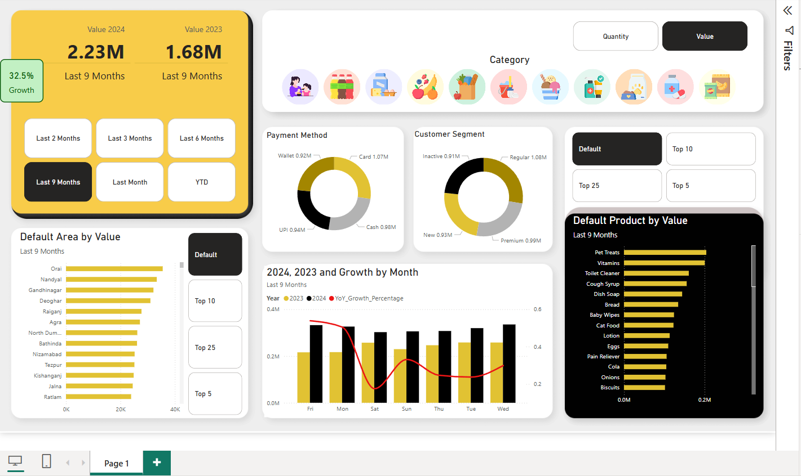
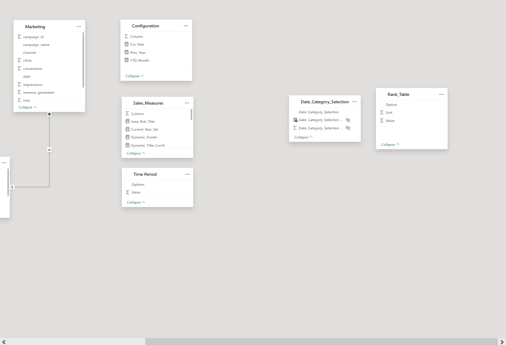

# 📊 Blinkit Dashboard

An end-to-end data analytics project built using **Python**, **PostgreSQL**, and **Power BI** to visualize and derive insights from Blinkit’s operations data. This project demonstrates the data engineering and visualization pipeline—starting from raw data transformation to building a fully interactive dashboard for decision-makers.

---

## 🚀 Features

- ✅ Cleaned and transformed raw operational data using Python
- ✅ Loaded and structured data into **PostgreSQL** relational tables
- ✅ Applied **denormalization techniques** to merge relevant data and created optimized views
- ✅ Built a **Power BI** dashboard with custom KPIs and interactive charts
- ✅ Enabled data-driven decision-making with clear visual insights

---

## 🛠 Tech Stack

- **Python** – Data cleaning and transformation
- **PostgreSQL** – Data storage, table creation, and denormalization
- **Power BI** – Dashboard design and visualization

---

## 📷 Screenshots

---

